# parcial_cloud

**Despliegue .war**

El archivo de despliegue del sistema se encuentra en:


## Diagrama Arquitectura

1. Capa de Presentación (Frontend):
La aplicación cuenta con una interfaz web desarrollada en HTML que permite a los usuarios registrar mascotas y consultar la lista de registros. Esta capa puede ser accedida mediante un navegador web, cumpliendo la función de interactuar con el usuario final.

2. Capa de Aplicación (Lógica de Negocio):
La lógica de negocio está implementada en Java utilizando JSP (JavaServer Pages). A través de esta capa, se gestiona el flujo del registro y la consulta de mascotas.

3. Capa de Datos (Persistencia):
Los datos se almacenan y consultan desde una base de datos relacional MySQL, que se encuentra alojada en una instancia separada con sistema operativo Ubuntu. 


<br>

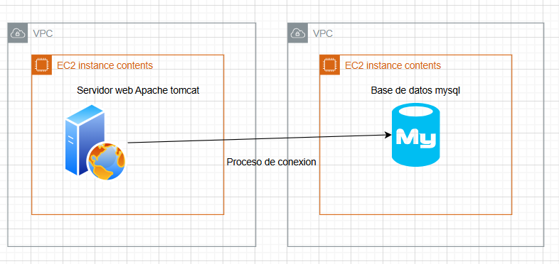

<br>


# Paso 1 - Configuracion de instancia para la Base de datos 

- Actualizar repositorios de la instancia:
<br>

```cmd
sudo su apt update -y

```

<br>


<br>

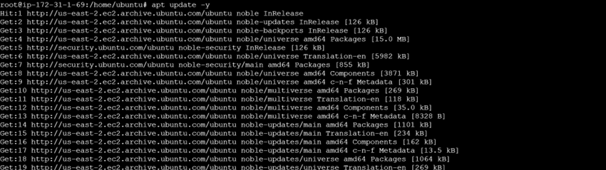

<br>


- Instalar MySql en Ubuntu:

```cmd
apt install mysql-server

```
<br>

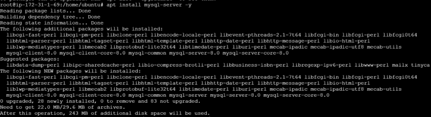

<br>


- Verificar estado de Mysql

```cmd
systemctl status mysql 

```
<br>

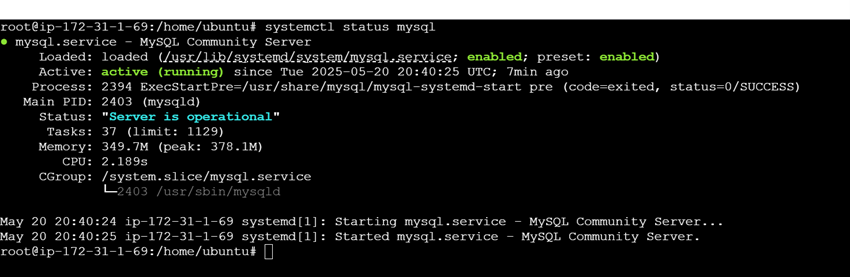

<br>

- Ingresar a Mysql como root

```cmd
mysql -u root -p 

```

<br>

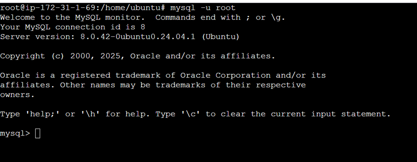

<br>


- Dentro de mysql debemos de cambiar la contraseña de root de la siguiente manera: 

```cmd
FULL PRIVILEGES;
ALTER USER 'root'@'localhost' IDENTIFIED WITH mysql_native_password BY '*123456';
exit;

``` 

<br>

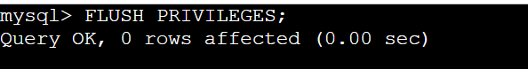


<br>
- Restablecer MySql en Ubuntu:

```cmd
systemctl restart mysql

```

<br>


<br>


- Ingresar con las nuevas credenciales a mysql

<br>


```cmd
mysql -u root -p 

```


<br>

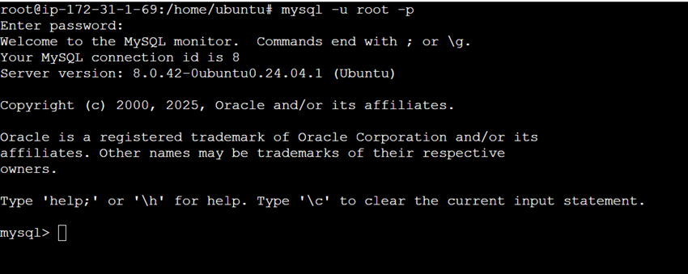


<br>


- Crear base de datos y tabla


```cmd
CREATE DATABASE vettrack;
USE vettrack;
CREATE TABLE mascotas (
    id INT AUTO_INCREMENT PRIMARY KEY,
    nombre_mascota VARCHAR(100) NOT NULL,
    nombre_dueno VARCHAR(100) NOT NULL
);
```

<br>

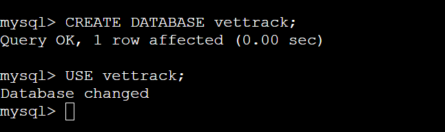


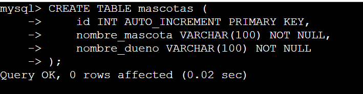

<br>
- Crear nuevo usuario para conexion remota

<br >


```cmd
CREATE USER 'admin'@'%' IDENTIFIED BY '*123456';
GRANT ALL PRIVILEGES ON *.* TO 'admin'@'%' WITH GRANT OPTION;
```

<br>

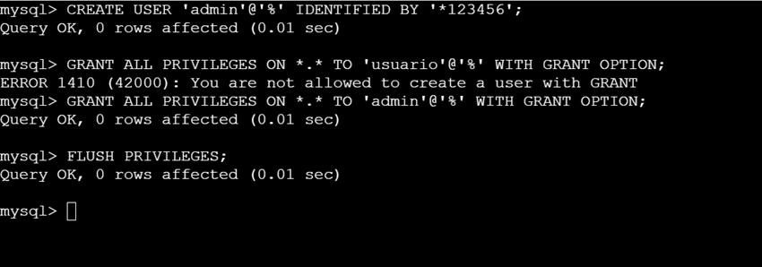

<br>


<br>
- Habilitar que cualquier dispositivo se pueda conectar a mi bd


<br>

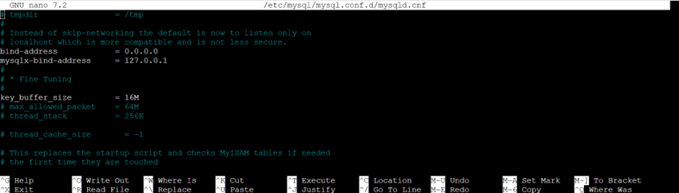

<br>


<br>
- reinicair servicio mysql


<br>

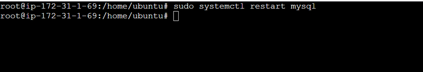

<br>


# Paso 2 - Configuracion instancia - Servidor web tomcat 10 


<br>
- Instalar jdk 

<br >


```cmd
apt install jdk-default -y
```
<br>

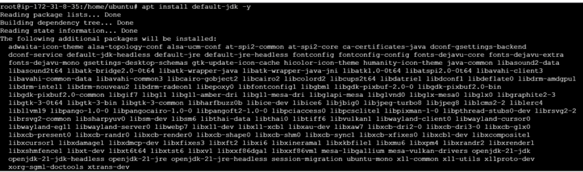

<br>


<br>
- Instalar tomcat10 

<br >


```cmd
apt install tomcat10 tomcat10-admin
```
<br>

<br>

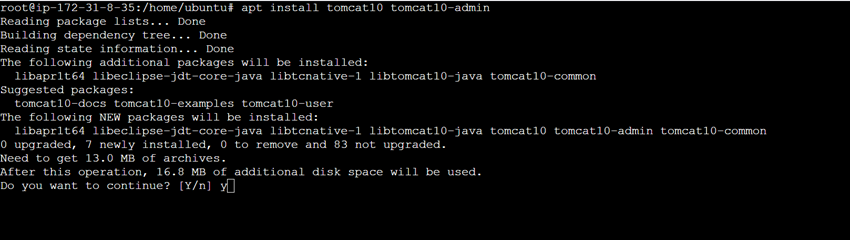

<br>
<br>
- Configurar usuario


<br>

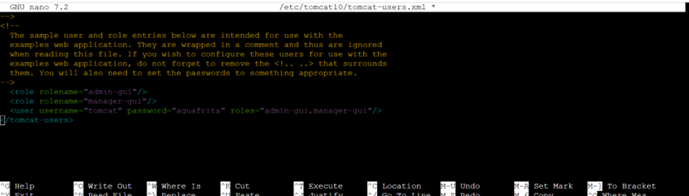

<br>
<br>
- Ingresar por puerto 8080


<br>

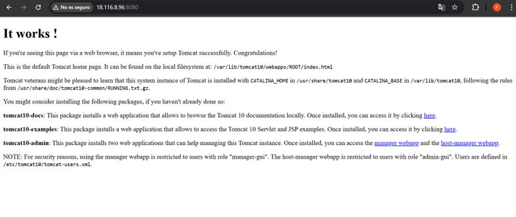

<br>


<br>
- Ingresar credenciales


<br>

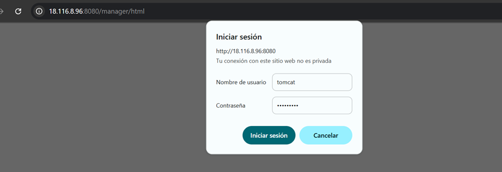

<br>

<br>
- Panel de admin


<br>

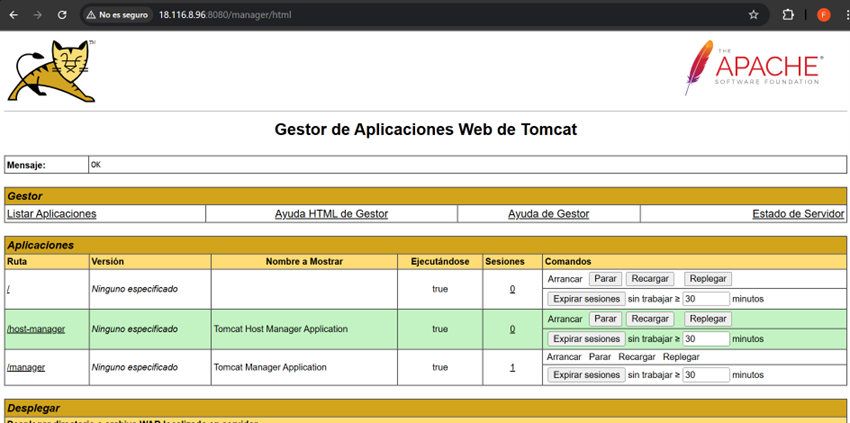


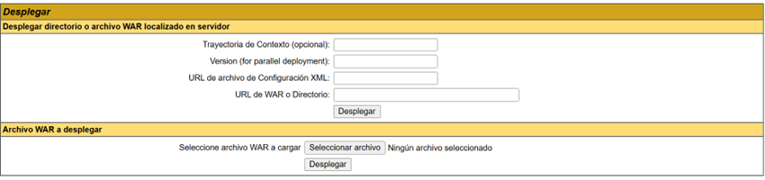

<br>

<br>
- Seleccionar archivo .war y desplegar


<br>

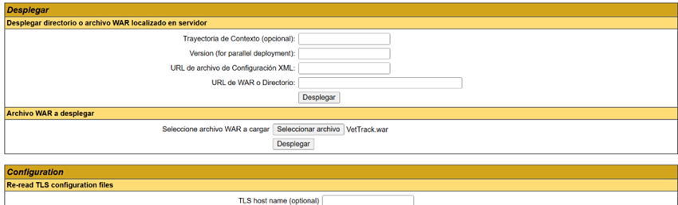

<br>
<br>
- Despliegue exitoso en: http://18.116.8.96:8080/VetTrack/


<br>

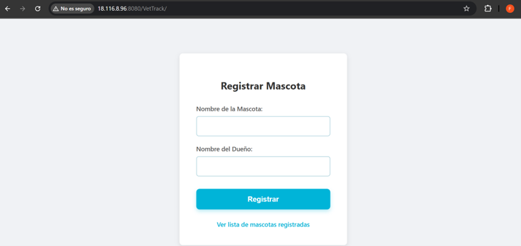

<br>


