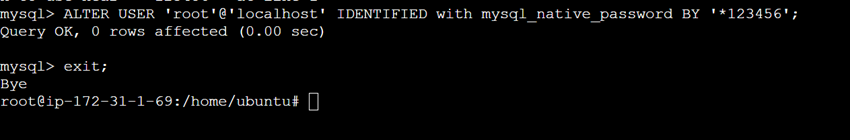

# parcial_cloud

**Despliegue .war**

# Paso 1 - Configuracion de instancia para la Base de datos 

- Actualizar repositorios de la instancia:
<br>

```cmd
sudo su apt update -y

```

<br>


<br>


<br>


- Instalar MySql en Ubuntu:

```cmd
apt install mysql-server

```
<br>


<br>


- Verificar estado de Mysql

```cmd
systemctl status mysql 

```
<br>


<br>

- Ingresar a Mysql como root

```cmd
mysql -u root -p 

```

<br>


<br>


- Dentro de mysql debemos de cambiar la contraseña de root de la siguiente manera: 

```cmd
FULL PRIVILEGES;
ALTER USER 'root'@'localhost' IDENTIFIED WITH mysql_native_password BY '*123456';
exit;

``` 

<br>




<br>
- Restablecer MySql en Ubuntu:

```cmd
systemctl restart mysql

```

<br>


<br>
- Ingresar con las nuevas credenciales a mysql
```cmd
mysql -u root -p 

```
<br>


<br>
- Crear base de datos y tabla
```cmd
CREATE DATABASE vettrack;
USE vettrack;
CREATE TABLE mascotas (
    id INT AUTO_INCREMENT PRIMARY KEY,
    nombre_mascota VARCHAR(100) NOT NULL,
    nombre_dueno VARCHAR(100) NOT NULL
);
```

<br>


<br>
- Crear nuevo usuario para conexion remota
```cmd
CREATE USER 'admin'@'%' IDENTIFIED BY '*123456';
GRANT ALL PRIVILEGES ON *.* TO 'admin'@'%' WITH GRANT OPTION;
```

<br>


<br>


# AA 

<br>


<br>


# AA 

<br>


<br>


# Paso 2 - Configuracion instancia - Servidor web tomcat 10 

<br>


<br>


# bbb

<br>


<br>
# bbb

<br>


<br>
# bbb

<br>


<br>


# bbb

<br>


<br>

# bbb

<br>


<br>

# bbb

<br>


<br>

# bbb

<br>


<br>
# bbb

<br>


<br>


